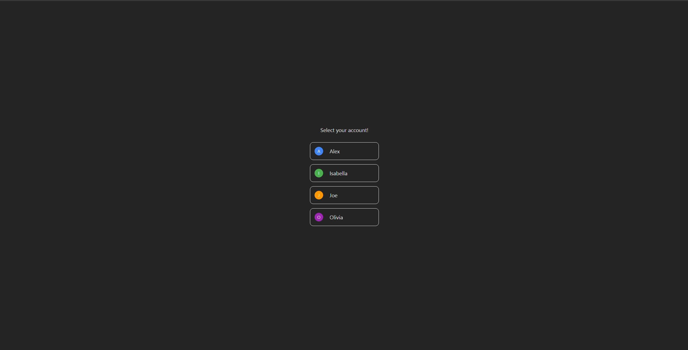
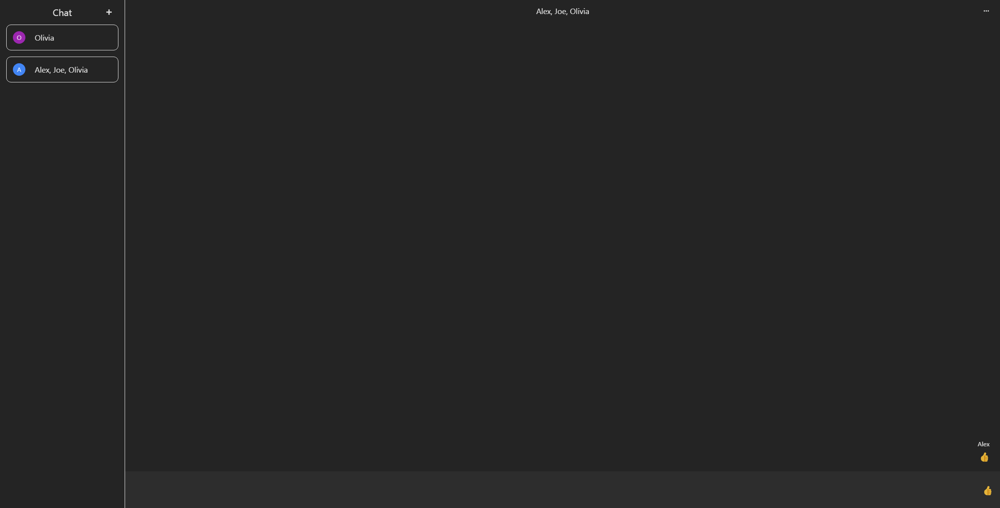
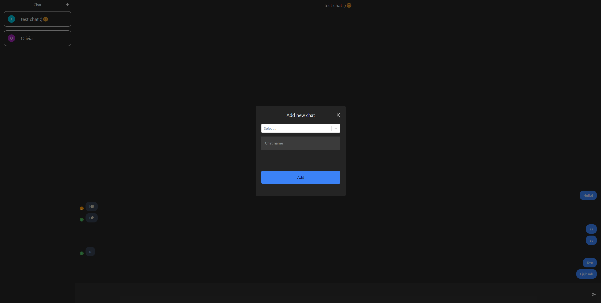

# Textenger

## Description

Textenger is chat app in which you can create named group chats and send messages to your friends (but only if they're predefined in data base)

## Table of Contents

- [Installation](#installation)
- [Usage](#usage)
- [Features](#features)
- [Development](#development)

## Installation

Requirements:

- Node.js
- yarn

To install project dependencies use

```
yarn install
```

To run app use

```
yarn run dev
```

To build app use

```
yarn run build
```

## Usage

|                                                           |                                                                     |
| :-------------------------------------------------------: | :-----------------------------------------------------------------: |
|          _1. Home page_           |               _2. Main page_                |
| _3. Add new chat modal_  | _4. Messages with send date_  |

## Features

1. Home page
   Here you can select on which user you want to log in and access chats.
2. Main page
   - On main page user can select existing thread or add new one. After selecting chat user can writte messages to chat members.
   - After clicking on message user can access message send date.
3. Add new chat modal
   User can add new chat threads using modal.

## Development

- Problems faced during coding  
  While coding this app I had some problems with firebase data structures.
  I had to find a way to keep flat data structure and in the same time be able to store required data.
  Meanwile I had to convert data types to be easli accessible on frontend.

- Potential further development
  - Deleting [IN TODO] and editing chats.
  - Managing chat members (add/delete member)
  - Message reactions
  - Deleting messages
  - Chat images instead of avatar with first letter
  - Customizable chat colors
