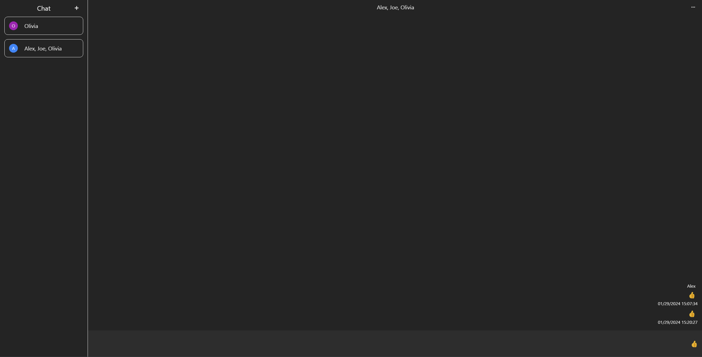

# Textenger

## Description

Textenger is chat app in which you can create named group chats and send messages to your friends (but only if they're predefined in data base)

## Table of Contents

- [Installation](#installation)
- [Usage](#usage)
- [Features](#features)
- [Development](#development)

## Installation

Requirements:

- Node.js
- yarn

To install project dependencies use

```
yarn install
```

To run app use

```
yarn run dev
```

To build app use

```
yarn run build
```

## Usage

|                                                                         |                                                                     |
| :---------------------------------------------------------------------: | :-----------------------------------------------------------------: |
|                 _1. Home page_                  |               _2. Main page_                |
|        _3. Add new chat modal_         | _4. Messages with send date_  |
| _5. Thread modification panel_  |                                                                     |

## Features

1. Home page
   Here you can select on which user you want to log in and access chats.
2. Main page
   - On main page user can select existing thread or add new one. After selecting chat user can writte messages to chat members.
   - When message input is empty user can send emoji selected in chat modification panel, emoji sent this way has no background color.
   - After clicking on message user can access message send date.
   - In right corner user can open/close thread modification panel  
     
   - Thread modification panel allows user to change:  
      
     - Thread name  
       
     - Thread message color theme  
       
     - Thread emoji  
       
   - Thread modification panel also allows user to delete other users if there is more than 2 chat members  
     
   - In the bottom user can delete whole thread  
     
3. Add new chat modal  
   User can add new chat threads using modal.
4. Other  
   Mobile first aproach - app is made to work on every device size.

## Development

- Problems faced during coding  
  While coding this app I had some problems with firebase data structures.
  I had to find a way to keep flat data structure and in the same time be able to store required data.
  Meanwile I had to convert data types to be easily accessible on frontend.

- Potential further development
  - Managing chat members (add member)
  - Message reactions
  - Deleting messages
  - Chat images instead of avatar with first letter
